# Viscraft

Viscraft is an AI-powered product ad visual generator. Users can organize their work into projects, upload a product image, pick a scene style and mood, and let the AI generate a ready-to-use ad visual — all from a clean, focused workspace.

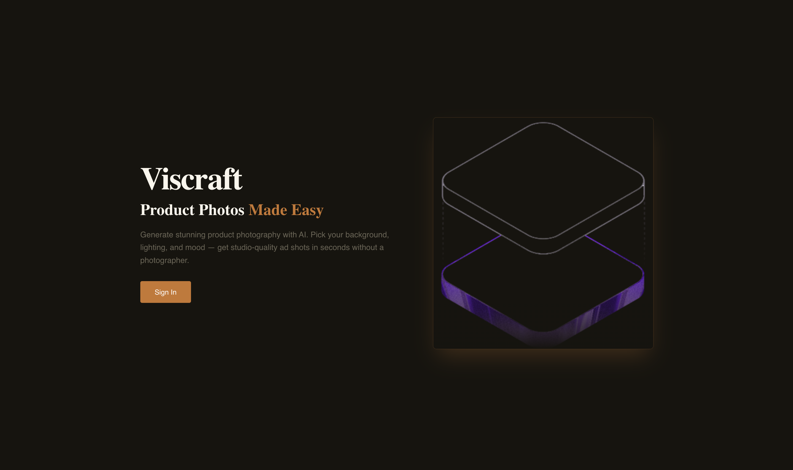

---

## Features

### Authentication
Register and log in with a JWT-based session. Your workspace and generated images are tied to your account.

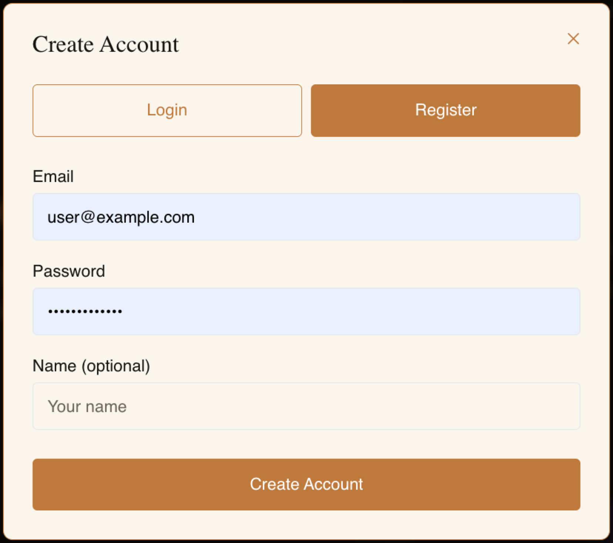 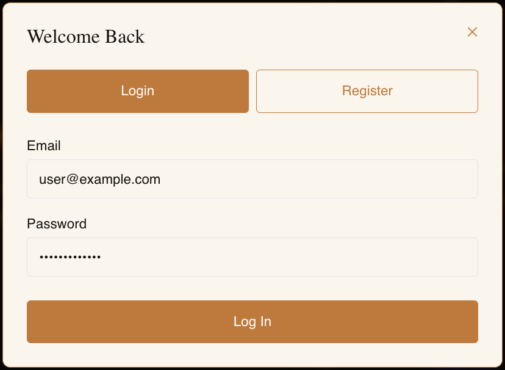

### Project Management
Organize your work into campaigns/projects. Each project holds its own set of generated scenes.

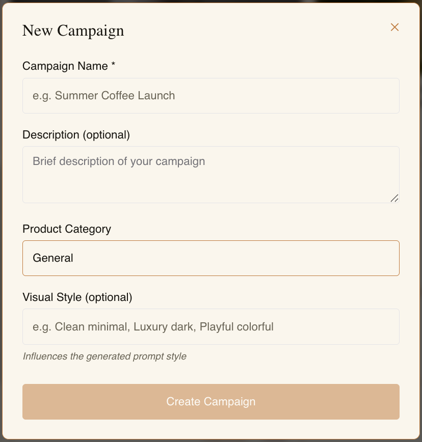

### AI Scene Generation
Upload a product photo, choose a scene style, set a mood and lighting, optionally add a reference image — and generate a product ad visual powered by Pollinations AI.

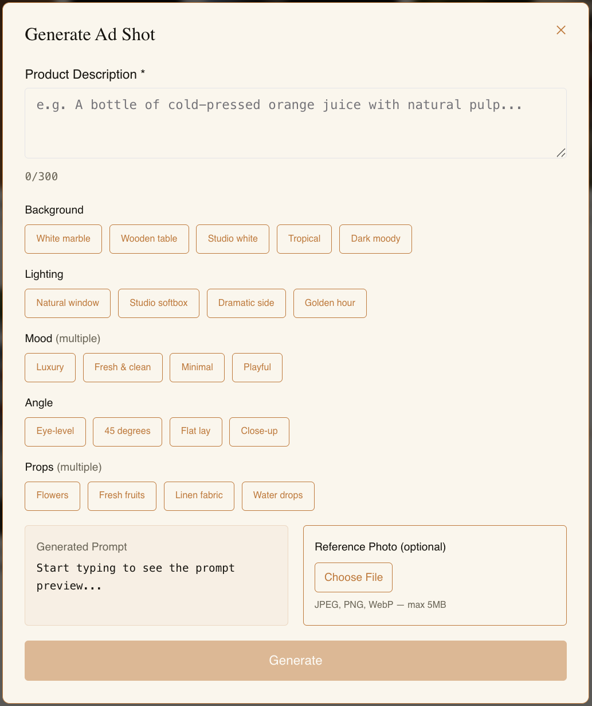

### Workspace
Browse all your generated scenes in a grid layout. Each card shows the result with options to view details, regenerate, or delete.

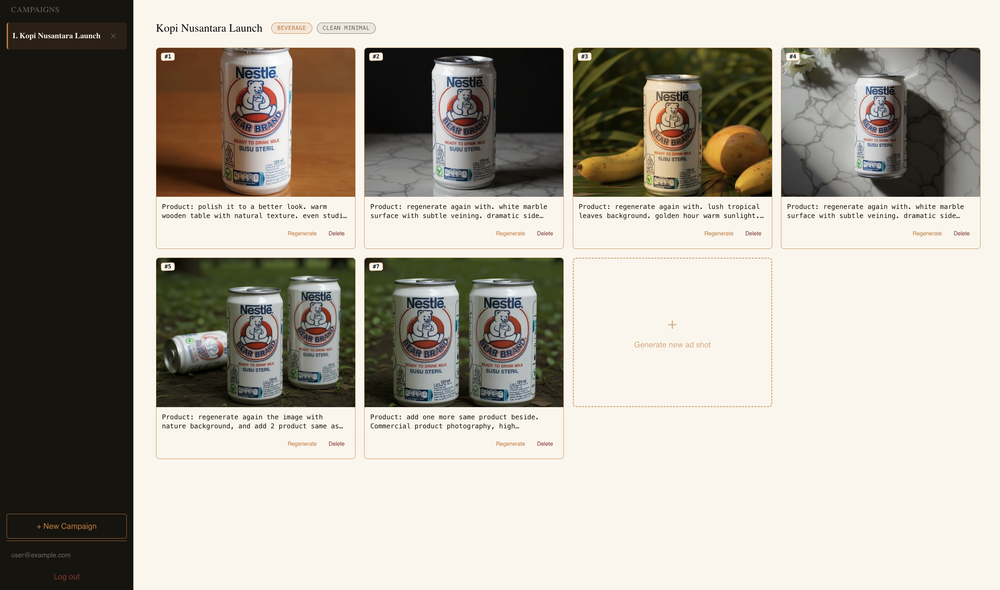

### Scene Detail & Regenerate
View a full-size scene, inspect the prompt that was used, and regenerate with tweaked settings if needed.

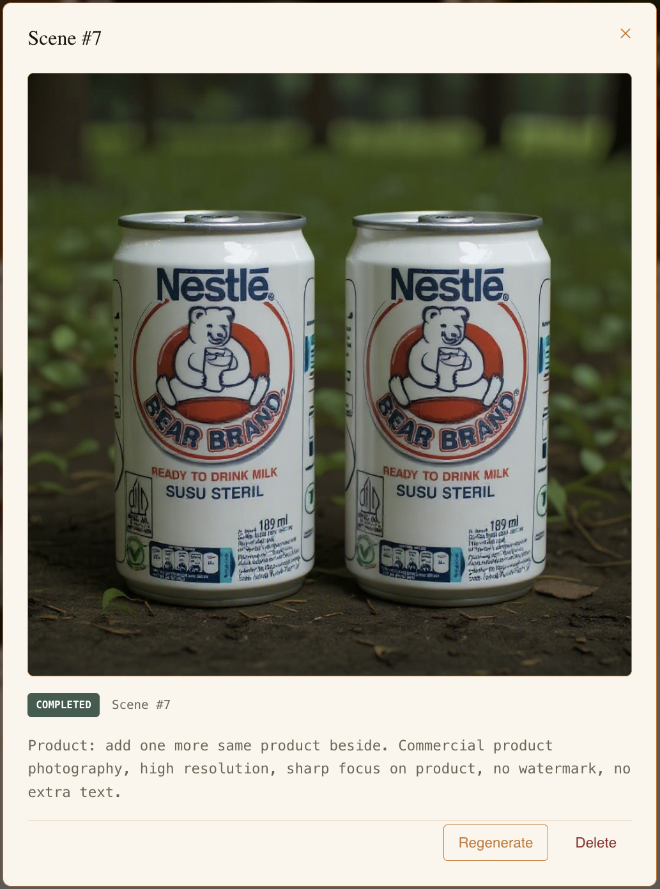 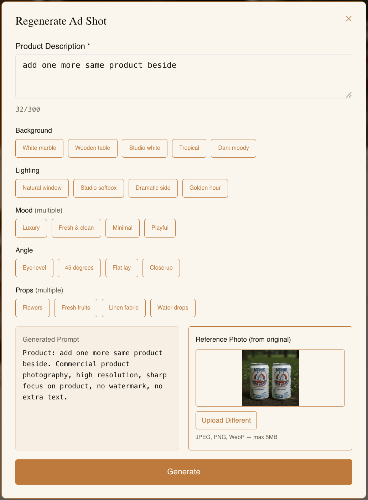

### Onboarding Tour
First-time users get a guided tour of the workspace so they know exactly where to start.

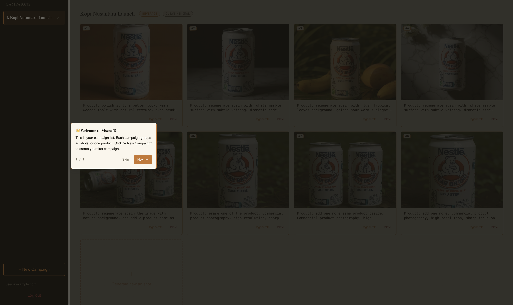 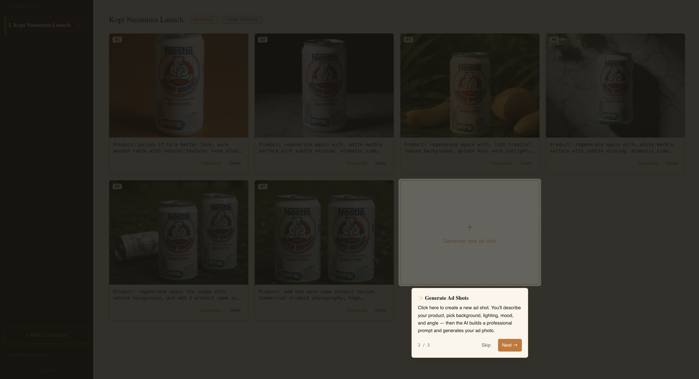 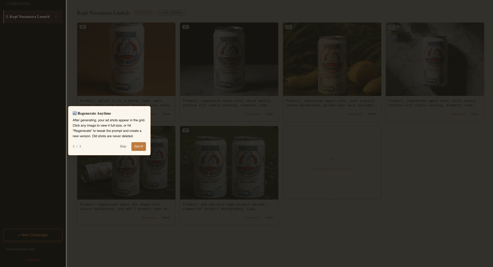

---

## Tech Stack

| Layer | Tech |
|---|---|
| Frontend | React, TypeScript, Vite, Chakra UI v3, Zustand, Axios |
| Backend | Go, Gin, PostgreSQL, JWT |
| AI | Pollinations AI (image generation) |
| Infrastructure | Docker, Docker Compose, Nginx |

---

## Project Structure

```
Viscraft/
├── viscraft-frontend/    # React app (Vite + TypeScript)
├── viscraft-backend/     # REST API (Go + Gin)
└── viscraft-docs/        # Screenshots and documentation
```
